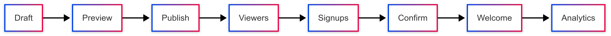

# Kit Builders — Prototype / POC Monorepo

A **minimal, intentionally incomplete prototype** loosely Kit‑inspired, sketching a single happy‑path funnel **(onboarding → activation → conversion)** across **emails, landing pages, sequences, and lightweight analytics**.  
Primary purpose: illustrate a possible architectural shape (UI ↔ API data flow, editor composition, background job handoff). It is **explicitly NOT** production ready, product complete, security hardened, nor an official Kit codebase.  
Stack (illustrative only): **Next.js (App Router) + React (TypeScript, Tailwind)** UI, **Ruby on Rails 7.2** API, **PostgreSQL**, **Redis + Sidekiq**. Light client state via **Zustand**; UI primitives from **shadcn/ui, Radix UI, lucide-react, React Email**.

> Naming usage: “Kit” here is purely descriptive for internal exploration; this repo has **no affiliation with, endorsement from, or code sourced from any actual Kit production system**.

> Disclaimer / Caveats (read first)
>
> - Code is **lightly exercised / not systematically tested**; latent bugs & race conditions expected.
> - Security, authZ roles, multi‑tenant isolation, billing accuracy, data retention, PII handling, and deliverability are **NOT hardened**.
> - “Implemented” usually means a **UI stub or partial flow**, not full lifecycle logic.
> - Analytics, experiments, feature flagging, segmentation, and sequence execution are **simplified mock slices**.
> - Treat this strictly as a **throwaway learning scaffold / architectural sketch**, never as a seed for real production.
> - Any capacity / KPI numbers shown are **illustrative thought exercises**, not validated benchmarks.

---

## Overview

This prototype sketches an end‑to‑end creator experience (happy‑path only):

- Fast **onboarding** (guided drawer and templates)
- **Activation** via ready‑to‑ship flows (broadcasts, sequences, LP builder)
- **Conversion**: landing pages with smart‑crop hero images, A/B tests, subscribe forms, double opt‑in, analytics, RUM, and experiment guardrails.

It includes **rudimentary placeholders** for: deliverability‑adjacent analytics, feature flags & plan gates (basic), webhook ingestion (simplified), CSV export/import stubs, Stripe billing stubs, and AI authoring hook points. Most are **scaffolds, not finished subsystems**.

Directory highlights (synced with repo):

```
apps/
  web/          -> Next.js 15 app (App Router) – dashboard, editors, analytics UI, public LP renderer
  api/          -> Rails 7.2 API – models, controllers, workers, webhooks, experiments, exports
packages/
  design-system/ -> Reusable React UI primitives (Button, Input, BlocksPalette, etc.)
  email-templates/ -> React Email source + rendering scripts
  templates/       -> Landing & email template metadata/helpers
  web-docs/        -> Storybook / docs stories (early component documentation)
```

Recent demo tweaks (non‑exhaustive, unstable):

- Combined dashboard summary endpoint (shape may change)
- Sticky top bar + visual background experiments
- Rich sequence/email editor (TipTap v3) – limited extension set
- Button contrast & dark mode pass (accessibility **not audited**)

### Dashboard snapshot (illustrative)


<sub>Static screenshot of the current demo dashboard UI (placeholder metrics & flags). File: `docs/screenshots/dashboard.png` — replace freely; no expectation of visual stability.</sub>

---

## Illustrative (non‑binding) demo goals

| Category        | Illustrative intention (not achieved / not guaranteed) | Status (approx) |
| --------------- | ------------------------------------------------------ | --------------- |
| Onboarding      | Fast draft to first publish (<10m)                     | Partial UI      |
| Experimentation | Show placeholder variant allocation + SRM              | Basic stub      |
| Analytics       | Lightweight engagement snapshot                        | Partial         |
| Contracts       | Typed web ↔ API DTOs                                  | Partial         |
| Background      | Demonstrate enqueue + worker processing chain          | Minimal         |
| RUM             | Capture LCP/TTFB for demo pages                        | Prototype       |
| Security        | Sketch signature verification placeholder              | Not implemented |

---

## Demo scope reference (functional slices)

| Slice          | What the prototype shows (simplified) | Real gaps / omissions          |
| -------------- | ------------------------------------- | ------------------------------ |
| Onboarding     | Drawer UI steps (static)              | No persisted progress          |
| Broadcasts     | Rich text draft editor                | No robust send pipeline        |
| Sequences      | Client‑side draft blocks              | No scheduling / execution      |
| Landing Pages  | Block builder & preview               | Limited publishing rules       |
| Smart Crop     | Basic focal point transform           | No CDN strategy                |
| Subscribe Flow | Double opt‑in happy path              | Limited error handling         |
| Experiments    | Simple allocation + SRM flag          | No lifecycle mgmt              |
| Analytics      | Minimal engagement snapshot           | No warehouse / retention       |
| Audience       | Segments placeholder + CSV stub       | No scalable import             |
| Webhooks       | Basic ingest endpoint                 | No signature verify / DLQ auth |
| Billing        | Stub checkout path                    | No real invoices / proration   |
| Exports        | CSV/JSON concept                      | Streaming not hardened         |

### Non‑functional (illustrative aspirations, not met)

| Quality       | Target / Mechanism                                 |
| ------------- | -------------------------------------------------- |
| Performance   | SSR LPs; SWR cache; sharp image transforms (basic) |
| Reliability   | Some retry semantics via Sidekiq (basic)           |
| Security      | Placeholder for signatures/auth scoping            |
| Scalability   | Monolith only; no real load testing                |
| Observability | Barebones RUM + queue count (manual)               |
| Compliance    | Minimal; no formal processes                       |

---

## Back‑of‑the‑envelope (illustrative only)

| Metric                | Assumption                             | Result                          |
| --------------------- | -------------------------------------- | ------------------------------- |
| Creators              | 5k creators                            | 5k                              |
| Subscribers / creator | 20k avg                                | 100M total                      |
| Broadcast cadence     | Weekly (4/mo)                          | 400M emails/mo                  |
| Webhook multiplier    | 1.2× (opens/clicks/bounces)            | 480M events/mo                  |
| Event storage (avg)   | 1KB                                    | 480GB/mo raw (warehouse needed) |
| RUM sampling          | 1M views/day raw                       | Sample 1–10%                    |
| Worker throughput     | 100 jobs/s per pod × 20 (hypothetical) | 2k jobs/s (NOT validated)       |
| Postgres strategy     | Hot vs cold data                       | Offload cold to warehouse       |

---

## Design patterns & architecture (exploratory choices)

| Topic               | Choice / Pattern                             | Rationale                                |
| ------------------- | -------------------------------------------- | ---------------------------------------- |
| Server architecture | Rails MVC                                    | Mature ecosystem, rapid CRUD & jobs      |
| Web architecture    | Next.js App Router (MPA + islands)           | Hybrid SSR/CSR for SEO + speed           |
| Frontend modularity | Single repository (monolith)                 | Simplifies DX; micro‑frontends deferred  |
| State management    | Local/component state + small Zustand stores | Minimal global footprint, explicit flows |
| UI primitives       | Radix + shadcn + Tailwind                    | Accessible, composable, rapid styling    |
| Data flow           | Unidirectional fetchers + SWR caching        | Predictable, avoids hidden side effects  |
| Background jobs     | Sidekiq + Redis queues                       | Demonstrate enqueue + retry semantics    |
| Experimentation     | A/B with SRM + χ² significance checks        | Catch allocation skew early              |
| Media handling      | Sharp transforms via Next image route        | On‑demand resizing & optimization        |
| Observability       | Custom RUM + queue metrics                   | Lightweight, focused signals             |

---

## Architecture (conceptual)


<sub>PNG manually exported from `docs/diagrams/architecture.mmd`.</sub>

### Sequence: Subscribe → Confirm → Welcome


<sub>PNG manually exported from `docs/diagrams/subscribe_confirm_sequence.mmd`.</sub>

---

## API design (prototype surface)

| Domain      | Endpoint (prefix /v1)              | Purpose               | Notes                      |
| ----------- | ---------------------------------- | --------------------- | -------------------------- |
| Auth        | /auth/sign_in                      | Session stub          | Enhance JWT later          |
| Pages       | /pages, /blocks                    | Landing pages CRUD    | Slug fetch via /pages/slug |
| Broadcasts  | /broadcasts                        | Create & send emails  | Worker send pipeline       |
| Sequences   | /sequences                         | Drip campaigns        | Scheduling TBD             |
| Experiments | /experiments, /experiments/results | A/B config + results  | SRM & significance         |
| Metrics     | /metrics/\*                        | Analytics series      | Cohorts, engagement        |
| RUM         | /rum/\*                            | Perf & events summary | Sampling client side       |
| Audience    | /segments, /imports, /exports      | Segments + CSV jobs   | Jobs + polling             |
| Webhooks    | /webhooks/ingest                   | ESP events intake     | DLQ & replay endpoints     |
| Billing     | /stripe/checkout, /stripe/webhook  | Plan upgrade          | Stubbed                    |
| Public      | /public/subscribe, /public/confirm | Opt‑in flow           | Tokens + redirect          |
| Admin       | /feature_flags, /feature_overrides | Flags & overrides     | Plan + % rollout           |

_Versioned base: `/v1/...` (surfaced to the web app via a Next.js internal proxy)._

Response example (cohorts):

```json
[{ "url": "https://example.com", "unique_clickers": 123, "ctr": 0.084 }]
```

---

## Data model (planned + partial)

| Table                   | Key Columns / JSON Fields                                                            | Purpose / Notes                                    | Index / Constraint Highlights                 |
| ----------------------- | ------------------------------------------------------------------------------------ | -------------------------------------------------- | --------------------------------------------- |
| orgs                    | id, name, plan                                                                       | Tenant / plan gating                               | plan; id PK                                   |
| contacts                | id, org_id, email, confirmed_at                                                      | Subscriber identity & opt-in state                 | (org_id,email) unique; org_id                 |
| confirmation_tokens     | contact_id, token, slug, variant, expires_at, used_at                                | Double opt‑in + attribution for LP / variant       | token unique; contact_id                      |
| pages                   | id, org_id, slug, theme_json                                                         | Landing pages + theme config                       | (org_id,slug) unique                          |
| blocks                  | id, page_id, kind, order, data_json                                                  | Ordered LP content blocks                          | (page_id,order); page_id                      |
| broadcasts              | id, org_id, subject, html                                                            | One‑off email sends                                | org_id                                        |
| deliveries              | id, org_id, contact_id, broadcast_id, status, opened_at, clicked_at, metadata        | Per-recipient delivery + engagement events         | (broadcast_id); (contact_id); partial(status) |
| sequences (planned)     | id, org_id, name, schedule_json (future), active                                     | Drip campaign container (draft now in client only) | (org_id,name) partial unique                  |
| sequence_steps(planned) | id, sequence_id, kind, position, config_json                                         | Normalized form of blocks for server execution     | (sequence_id,position)                        |
| events                  | id, payload(jsonb), created_at                                                       | RUM + analytics + experiment / CTA signals         | GIN(payload); created_at DESC                 |
| feature_flags           | key, enabled, rollout_pct                                                            | Global flag defaults                               | key unique                                    |
| feature_overrides       | org_id, key, enabled                                                                 | Org‑scoped flag overrides                          | (org_id,key) unique                           |
| experiments             | key, slug, variants_json{variants,alloc}, enabled, guardrail_note, last_evaluated_at | Experiment configuration & metadata                | key unique                                    |
| imports (planned)       | id, org_id, kind, status, stats_json                                                 | CSV import job tracking                            | org_id; status                                |
| exports (planned)       | id, org_id, kind, status, filter_json                                                | Export job tracking                                | org_id; status                                |

Indexes emphasize org scoping, uniqueness of emails per org, and JSONB GIN for flexible event querying. Planned tables denote future server persistence for currently in‑memory concepts.

## Health & Diagnostics (partial / planned)

| Aspect       | Mechanism / Endpoint                          | Notes                                    |
| ------------ | --------------------------------------------- | ---------------------------------------- |
| API health   | `/health` (Rails) returns `{ ok, db, redis }` | Consumed by web proxy `/api/health`      |
| Proxy timing | `x-proxy-duration-ms` header                  | Measures Next → Rails round‑trip latency |
| UI error log | POST `/api/app/events` kind: `ui_error`       | Fire-and-forget capture before full APM  |
| Queue stats  | (future) `/ops/queues`                        | Sidekiq latency / depth / retry          |
| Webhook DLQ  | `/ops/webhooks` replay controls               | Manual replay window                     |
| RUM metrics  | `/ops/rum`                                    | LCP/TTFB/device breakdown                |
| Experiments  | `/ops/experiments`                            | SRM & significance overview              |

Inline event schema example (UI error):

```json
{
  "kind": "ui_error",
  "scope": "page_create",
  "message": "Failed to save",
  "slug": "pricing",
  "ts": 1731012345678
}
```


````

## Current features (partial / unstable)

- Onboarding drawer; Dashboard CTAs & combined metrics endpoint
- Email / Sequence designer (TipTap v3) with:
  - Formatting: bold/italic/underline/strike, headings (H1–H3), lists, blockquote, code block (baseline), horizontal rule, links
  - Slash command palette (`/`) for quick insert (headings, lists, code, HR, image placeholder)
  - Plain vs Rich toggle (captures raw text for analytics & SMS segment estimation)
  - Word / character counts; SMS 160‑char segment estimation for `sms` blocks
  - (Images & syntax highlighting temporarily disabled pending extension version alignment)
- Sequence builder: drag‑reorder blocks (email, wait, sms, branch), inline editors, remove actions, persistent draft store (client only)
- LP builder: blocks (Hero / CTA / Subscribe / ThankYou / Features), **smart‑crop** & focal, SSR `<picture>`
- Subscribe → **double opt‑in** → **welcome** worker (rate‑limited)
- **Experiments**: variant selection, ramp control (simplified), SRM & χ² significance (basic), trends (rudimentary)
- **RUM**: p50/p95 LCP/TTFB, device breakdown, CTA/signup events
- Analytics: link cohorts, domain engagement, CSV exports
- Webhooks: basic ingest + retry semantics (DLQ / replay concepts, not hardened)
- Admin: feature flags, per‑org overrides, plan gates
- Image proxy: Next + sharp; signed URLs helper

### Sequence editor specifics
Data shape (`SequenceDraft`):
```ts
interface SequenceDraft { id: string; name: string; updatedAt: number; blocks: SequenceBlock[] }
type SequenceBlock = EmailBlock | SmsBlock | WaitBlock | BranchBlock;
````

Email & SMS blocks store both HTML and derived plain text (`bodyPlain`, `messagePlain`) enabling: analytics normalization, SMS length computation, future spam / deliverability heuristics.

Current gaps (see "Known gaps" below): scheduling & execution of sequences, conditional DSL evaluation for branches, analytics attribution across a drip chain.

---

## Known gaps / limitations (non‑exhaustive)

| Area                     | Current State             | Limitation                                                |
| ------------------------ | ------------------------- | --------------------------------------------------------- |
| Sequence scheduling      | Draft only                | No send/queue logic yet (no cron/backoff)                 |
| Sequence branching       | Simple text placeholder   | No parser / evaluation engine                             |
| Editor images            | Disabled                  | TipTap image ext version mismatch (v3 core vs v2 ext)     |
| Code highlighting        | Basic `<pre><code>` only  | Lowlight integration deferred (version conflict)          |
| Deliverability analytics | Basic domain/link cohorts | No seed list / inbox placement / bounce classification    |
| Feature flags            | In‑app toggle + overrides | No audit trail / targeting rules per segment              |
| Webhook security         | Basic structure           | Missing full signature verification & replay auth scoping |
| Billing                  | Fake Stripe flag          | No real subscription lifecycle / invoices                 |
| RUM                      | Core metrics (LCP/TTFB)   | No long tasks / INP / resource waterfall                  |
| Experiments              | SRM + χ²                  | No sequential testing / Bayesian bandits yet              |
| Access control           | Plan gates                | Lacks granular role/permission model                      |

## Future considerations (if this were extended)

- **Editor**: restore image + syntax highlight once TipTap ecosystem publishes full v3 set; add AI assisted rewrite/subject scoring endpoints.
- **Sequence Engine**: scheduling (delays, retry, calendar rules), branch condition evaluator (safe expression sandbox), per‑step reporting & conversion funnel.
- **Segmentation**: rule builder with preview counts, nested AND/OR, event property filters.
- **Deliverability**: seed list monitoring, bounce/complaint classification taxonomy, reputation scoring, inbox placement simulation.
- **Webhook Security**: provider signature verification (SES SNS / Sendgrid), rotating secrets, per‑org signing keys, replay nonce window.
- **Billing**: real Stripe checkout/session webhooks, proration, usage tracking for sends.
- **Warehouse / Analytics**: click/open events streaming to ClickHouse/BigQuery; incremental dbt models; derived retention & cohort dashboards.
- **Performance**: add INP, CLS, long task tracking; worker queue saturation alerts.
- **Privacy & Compliance**: DSAR automation (export/delete), consent versioning, encryption at rest for PII columns.
- **Access Control**: org roles (Owner/Admin/Editor/Viewer) and feature entitlements matrix.
- **Internationalization**: i18n message catalog, timezone‑aware scheduling, locale‑aware formatting.
- **Testing**: contract tests for sequence API (when added), synthetic RUM baseline in CI.

---

## AI integration

- **Authoring**: subject line scoring, tone rewrite, CTA variants, layout auto‑fill (Hero/Feature items).
- **Template gallery**: semantic search + “build from prompt” to scaffold LP/Email/Sequence.
- **Segment builder Copilot**: “contacts who clicked pricing and didn’t purchase”.
- **Analytics insights**: “why did CTR drop last week?” — anomaly detection + narrative.
- **Ops**: auto‑triage of webhooks failures; suggested replay windows.
- **Guardrails**: Bayesian bandits for allocation; auto‑tune ramp % within constraints.

---

## Run & develop

### Local (no Docker) — Fast iteration

Prereqs: Ruby 3.4.x, Node 22.x (Corepack), Postgres 15+, Redis 7+, `vips` (for sharp if needed).

Setup:


<sub>Detailed subscribe → confirm flow exported manually; source sequence kept as `.mmd` if edits needed.</sub>

NEXT_PUBLIC_API_URL=http://localhost:4000

````

Start services (separate tabs):

```bash
pnpm dev:api        # Rails on :4000
pnpm dev:web        # Next.js on :3000
# Optional background jobs
pnpm dev:sidekiq    # Sidekiq (queues: default, mailers)
````

Or combined:

```bash
pnpm dev:all        # API + Web
pnpm dev:full       # API + Sidekiq + Web
pnpm smoke:api      # Hit representative API endpoints (see scripts/smoke_endpoints.sh)
```

Visit: http://localhost:3000 → redirects to /dashboard (which calls API on :4000).

Common fixes:
| Symptom | Fix |
|---------|-----|
| 500 ECONNREFUSED | Ensure Rails on :4000 & NEXT_PUBLIC_API_URL correct |
| Missing images | Use local storage (ActiveStorage :local) |
| Jobs not processing | Start Sidekiq (pnpm dev:sidekiq) |
| Editor SSR warning | RichEditor is client/dynamic (already fixed) |

### Docker (parity & CI)

```bash
# one‑time
cp .env.example .env
docker compose up --build

# database
docker compose exec api bin/rails db:create db:migrate db:seed
docker compose exec api bin/rails rake seed:demo_data
docker compose exec api bin/rails rake seed:ai_demo  # optional demo content

# create MinIO bucket (first time)
mc alias set local http://localhost:9000 minio minio12345 || true
mc mb local/dev-bucket || true
```

Key routes:

- Web app: `/` · LP editor `/page/[id]/edit` · Audience `/audience`
- Public LP: `/p/[slug]` and `/p/[slug]/thanks`
- Broadcast analytics: `/analytics/broadcast/[id]`
- Ops: `/ops/queues`, `/ops/webhooks`, `/ops/rum`, `/ops/experiments`
- Admin: `/admin/flags`, `/admin/plan`, `/admin/experiments`
- Dev helpers (development only): `/v1/dev/latest_confirmation` (fetch most recent confirmation token for tests)

### Offline stack additions

- MinIO (`minio` service) emulates S3 (bucket: `dev-bucket`). Set `S3_EMULATOR=true` (default in `.env.example`) to bypass AWS signing and return direct PUT URLs.
- Mailhog captures outbound SMTP on `:1025`, UI at `http://localhost:8025`.
- Sidekiq worker now processes `default` + `mailers` queues.
- Dev test helper exposes confirmation token for Playwright to complete double opt‑in flow without reading DB directly.

### E2E (Playwright)

Run:

```bash
cd apps/web
pnpm exec playwright test
```

`subscribe-confirm.spec.ts` covers landing page subscribe → token retrieval → confirm redirect.

### Makefile shortcuts & billing stub

Targets:

```bash
make setup      # copy .env.example
make up         # docker compose up --build
make seed       # run db:seed inside container
make reset-db   # drop, recreate, migrate, seed
make e2e        # run Playwright test suite
make stripe-fake # trigger fake webhook update
```

Billing: with `FAKE_STRIPE=true` the API returns a stub checkout URL and immediately marks a local subscription active (plan from `price_id`). Disable by removing or setting flag to false to integrate real Stripe credentials.

---

## Diagrams

PNGs are committed directly. Source `.mmd` files in `docs/diagrams/` remain only as editable Mermaid definitions. There are **no local scripts or CI tasks** to regenerate them. Use an external tool (e.g. Mermaid Live Editor or a desktop renderer) to export a new PNG and overwrite the existing file (keep the same filename) if you change a diagram.


### LP publish flow (high-level)


