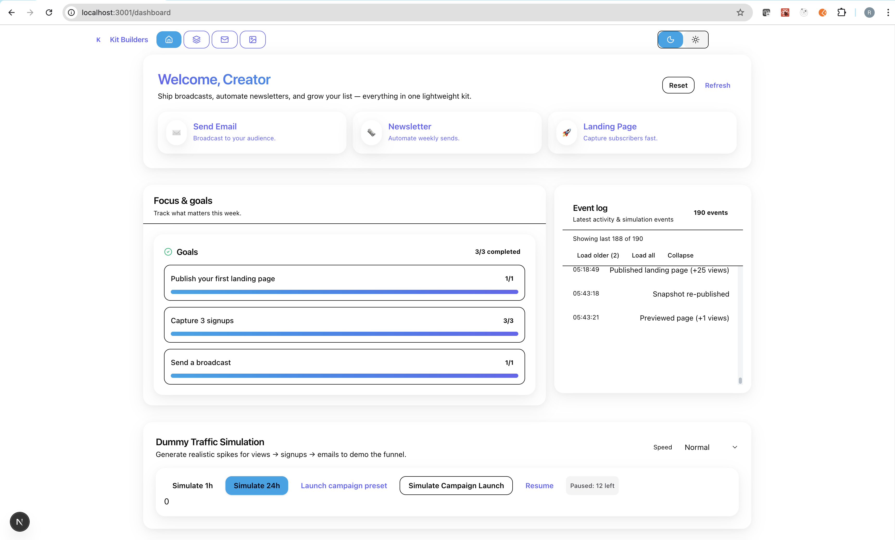

# Kit Builders — Front-End Prototype

local-only exploration of a creator + optimizer loop: draft → publish → observe → iterate across a landing page and a broadcast email workflow. Not production. No backend.

## Highlights

- Landing page draft vs published snapshots (variant chips + rollback)
- Accent theme extraction shared with email designer
- Email designer: subject & variant B metrics, rewrites, merge tags, spam/link analysis
- Assistant side panel (suggestions, snippets, transforms) + rich Tiptap editor surface
- Synthetic simulation + virtualized event log + lightweight heuristics for “lift”
- Dark mode, gradient/glass theming, quick load splash

## Demo

[](https://github.com/user-attachments/assets/454375fc-ef22-4d71-8727-8400b961466d)


## Tech Stack

Next.js 15 (App Router), React 19, Tailwind v4, Zustand, Tiptap, Radix + shadcn/ui, framer-motion, lucide-react. Persistence: localStorage only.

## Run

```bash
pnpm install
pnpm dev
```

Visit `/dashboard` and `/page` to explore core flows.

## Caveats

No auth, sanitization, backend, deliverability, or real analytics. Clearing storage wipes state. Heuristics emulate “AI” deterministically.

## More Detail

Full architecture & future roadmap: see [Design & Architecture](./design_doc.md).
