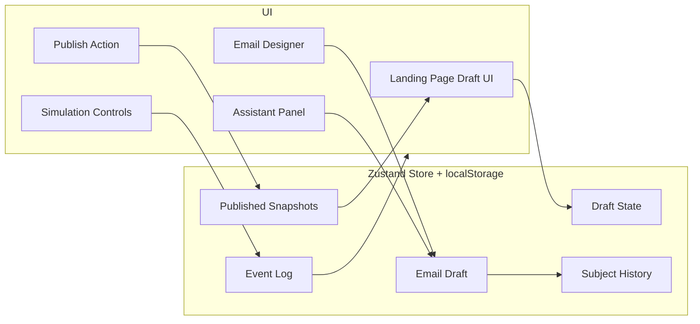
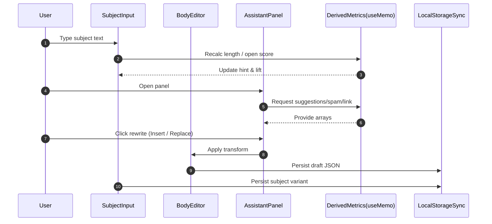

# Kit Builders – Design & Architecture Document

## Table of Contents

- [Disclaimer / Caveats](#disclaimer--caveats)
- [Overview](#overview)
- [Repo Layout](#repo-layout)
- [User-Facing Capabilities](#user-facing-capabilities)
- [Current Feature Inventory](#current-feature-inventory)
- [Functional Requirements](#functional-requirements)
- [Non-Functional Requirements](#non-functional-requirements)
- [UI / UX Principles](#ui--ux-principles)
- [Architecture Summary](#architecture-summary)
- [Runtime Data Flows](#runtime-data-flows)
  - [Publish & Snapshot Flow](#publish--snapshot-flow)
  - [Email Authoring Flow](#email-authoring-flow)
  - [Simulation & Event Log Flow](#simulation--event-log-flow)
- [State & Persistence](#state--persistence)
- [Data Shape (Conceptual Models)](#data-shape-conceptual-models)
- [In-Memory & Local Storage Keys](#in-memory--local-storage-keys)
- [Quality & Observability Hooks](#quality--observability-hooks)
- [Accessibility & Theming](#accessibility--theming)
- [Performance Techniques](#performance-techniques)
- [Security & Privacy (Prototype)](#security--privacy-prototype)
- [Extensibility Points](#extensibility-points)
- [Mermaid Diagrams](#mermaid-diagrams)
  - [High-Level UI / Store Interaction](#high-level-ui--store-interaction)
  - [Email Designer Assist Layer](#email-designer-assist-layer)
- [Testing Approach (Planned)](#testing-approach-planned)
- [Risks & Gaps](#risks--gaps)
- [Future Considerations](#future-considerations)
- [Glossary](#glossary)

---

## Disclaimer / Caveats

- Prototype only, **no real backend**, all persistence = `localStorage`.
- Security, auth, multi-tenancy, rate limiting, role systems are **absent**.
- Email sending, analytics ingestion, segment evaluation, and experiment math are **illustrative / simulated**.
- AI features (rewrite, scoring, suggestions) are **heuristic placeholders** (deterministic string transforms + simple scoring logic) – no external LLM calls.
- Data durability not guaranteed (local browser storage only). Clearing cache wipes state.
- Performance profiling minimal; concurrency scenarios not addressed.

---

## Overview

This prototype showcases a funnel toolchain inside a single Next.js (App Router) application:

| Funnel Stage | Implemented Elements                                   | Goal                                |
| ------------ | ------------------------------------------------------ | ----------------------------------- |
| Attract      | Landing page draft + template gallery + theme accent   | Rapid iteration on LP copy & layout |
| Convert      | Publish snapshot & variant switching                   | Demonstrate immutable versioning    |
| Engage       | Broadcast email designer with advanced authoring panel | Better copy quality + productivity  |
| Optimize     | Basic analytics counters + variant lift approximation  | Illustrate measurement & iteration  |
| Learn        | Event log virtualization + simulation controls         | Operational feedback & debugging    |

Emphasis: **rich editor UX**, **visual refinement (dark mode / gradients / blur surfaces)**, **low-friction publishing loop**.

---

## Repo Layout

```
/ (single Next.js app)
  next.config.mjs
  src/app/...
    dashboard/              # Metrics panels, event log, simulation panel
    builder/page/[pageId]/   # Landing page builder (not fully covered here)
    builder/email/[emailId]/ # Advanced broadcast email designer
    page/                    # Public landing page (published) viewer
    broadcast/               # Broadcast index / placeholder
  src/components/           # Panels, UI primitives, rich panels, top bar
  src/components/ui/        # Button, Card, Input, Tooltip, etc.
  src/lib/utils.ts          # Helpers
  src/lib/editor/           # (Editor integration scaffolding)
```

(No Rails/API packages in this simplified variant; conceptually those would live in a separate service.)

---

## User-Facing Capabilities

- Landing page draft editing + full-width **template gallery** (selection persists visually)
- Theme accent extraction + sync into email designer for tonal consistency
- Immutable **publish snapshot** with separate draft layer + history / rollback + variant labeling
- Email designer (Tiptap-based) with:
  - Subject line suggestions & A/B variant (Subject + Variant B + open-rate heuristic + lift calc)
  - Preheader field, character & length guidance
  - Spam trigger scoring (keyword weights) & severity classification
  - Link analysis (duplicate, UTM presence, protocol security flags)
  - Inline body word/char counts, reading time estimation
  - Merge tags: popover list + inline `{{` autocomplete + assistant quick insert
  - Snippet insertion (CTA button, signature, divider)
  - Body rewrite variants (concise, action close, bullet extraction) with Insert / Replace
  - Inline AI-style rewrite application (heuristic transforms)
  - Image paste/drag placeholder hooks (scoped for extension)
  - Slash command palette (headings, lists, HR, code, image placeholder)
  - Bubble formatting menu, dark mode adjustments
  - Test email modal (simulated)
  - Live preview (desktop/mobile toggle)
- Simulation Panel (elsewhere) with start/pause/resume/stop + progress bar + event retention policy
- Event Log Panel with virtualization, incremental fetch, load-all/collapse controls & persisted visible count
- Analytics mini-panels (counts, variant lift shown in context) – illustrative
- UI theming: layered backgrounds (`--bg`, `--bg-1`, `--bg-2`), glass surfaces, gradient accents
- Dark mode contrast audit (reworked tokens & accessible color pairings)
- Text selection normalization (removal of accidental `user-select:none` on content regions)

---

## Current Features

| Area           | Feature                                    | Notes                                                        |
| -------------- | ------------------------------------------ | ------------------------------------------------------------ |
| Landing Page   | Full-bleed template gallery                | Responsive 1–4 column grid, active state glow                |
| Landing Page   | Draft vs Published snapshot                | Distinct layers; dirty detection badge                       |
| Landing Page   | Variant selection (historical)             | Variant chips switch snapshot view                           |
| Landing Page   | Accent theme extraction                    | Propagated to email designer -> consistent UI accent         |
| Email Designer | Subject suggestions                        | Deterministic rotation array (seed refresh)                  |
| Email Designer | Subject A/B lift heuristic                 | Character-length & token scoring model approximation         |
| Email Designer | Merge tags (popover + inline autocomplete) | `{{` triggers filtered list near caret                       |
| Email Designer | Snippets & rewrite variants                | Quick composition accelerators                               |
| Email Designer | Spam & link analysis                       | Regex scanning -> severity + domain tags                     |
| Email Designer | Word/char + reading time                   | Derived from stripped HTML body                              |
| Email Designer | Assistant panel persistence                | LocalStorage flag remembers open state                       |
| Email Designer | Preview modal (desktop/mobile)             | Inline Gmail-like frame simulation                           |
| Email Designer | Floating action bar                        | Sticky top actions without crowding subject area             |
| Publishing     | Snapshot history + rollback                | Maintains list of prior published states with variant labels |
| Simulation     | Pause/Resume/Stop + progress               | Fine-grained control for mock event generation               |
| Event Log      | Virtualization + incremental load          | Performance on large log sets                                |
| Event Log      | Load All / Collapse                        | User control for memory / clarity                            |
| Theming        | Gradients + glass cards                    | Subtle motion + blur, hover elevation                        |
| Accessibility  | Keyboard & focus states                    | Radix primitives leveraged                                   |
| Performance    | React memoization in panels                | Avoid unnecessary re-renders                                 |

---

## Functional Requirements

| Slice            | Requirement (Prototype)             | Met?    | Gap                                           |
| ---------------- | ----------------------------------- | ------- | --------------------------------------------- |
| LP Templates     | Select & apply template instantly   | Yes     | No tagging/filtering yet                      |
| Publish Snapshot | Persist immutable published version | Yes     | No diff viewer UI (internal only)             |
| Variant History  | Label & switch variants             | Partial | No analytics per variant yet                  |
| Email Draft      | Persist subject/body/fields locally | Yes     | No server sync / multi-device                 |
| A/B Subject      | Provide variant + predicted lift    | Yes     | Real statistical model absent                 |
| Spam Detection   | Highlight risky terms               | Yes     | No adaptive weighting / false positive tuning |
| Merge Tags       | Insert tags quickly                 | Yes     | No validation for unknown tags                |
| Rewrites         | Offer alternative phrasing          | Yes     | AI sophistication missing                     |
| Simulation       | Generate events & progress          | Yes     | Deterministic patterns only                   |
| Event Log        | Efficiently show large logs         | Yes     | No cross-session merge strategy               |
| Theme Sync       | Share accent color                  | Yes     | No multi-theme palette sets                   |

---

## Non-Functional Requirements

| Quality       | Current Approach                                  | Notes                                        |
| ------------- | ------------------------------------------------- | -------------------------------------------- |
| Performance   | Virtualized lists; memoization; lean store slices | Adequate for prototype scale                 |
| Resilience    | LocalStorage try/catch guards                     | Still vulnerable to quota/full storage       |
| Usability     | Progressive disclosure (assistant panel)          | Needs onboarding hints                       |
| Accessibility | Semantic headings, focus rings                    | More ARIA labeling for complex menus pending |
| Dark Mode     | Tokenized backgrounds & surfaces                  | Contrast verified on key panels              |
| Observability | Toast notifications (UX)                          | No telemetry export                          |

---

## UI / UX Principles

- **Separation of cognitive zones**: authoring (body), meta (subject/variant/preheader), actions (floating bar), insights (assistant panel).
- **Soft layering**: gradients + blur differentiate strata without harsh borders.
- **Micro-feedback**: toasts, active selection badges, subject stat chips.
- **Restraint**: limited color accents; rely on depth & subtle motion.

---

## Architecture Summary

Pure client-side architecture with **Zustand** for ephemeral + persisted application state. No remote API calls in this snapshot; future extension would introduce fetch layer & typed DTO boundaries.

Layers:

1. Presentation (React components / panels)
2. Composition Helpers (editor transforms, suggestion generators)
3. State (Zustand store slices + selectors)
4. Persistence (localStorage serialization / hydration)
5. Utilities (scoring, spam scanning, link parsing)

---

## Runtime Data Flows

### Publish & Snapshot Flow

1. User edits landing draft
2. Draft autosaved locally
3. Publish action serializes draft → snapshot object (id, ts, variant?)
4. Snapshot appended to history array (capped) & flagged current
5. UI dirty indicator compares current draft vs latest snapshot

### Email Authoring Flow

1. Subject input updates store & triggers recalculated metrics (length tier, open-rate heuristic)
2. Suggestions computed from deterministic base array & seed
3. Body changes → plain text extraction → spam/link analysis & counts
4. Assistant panel offers rewrites; user insert/replace operations mutate body HTML
5. Inline merge tag autocomplete listens for regex `{{partial` & positions suggestion popover

### Simulation & Event Log Flow

1. Simulation start triggers synthetic event generation (timestamps, types)
2. Events appended to in-memory log (and persisted if enabled) with cap or window
3. Event Log Panel virtualization window recalculates visible subset
4. User clicks “Load All” to bypass incremental limit; “Collapse” restores default count

---

## State & Persistence

| Concern               | Mechanism          | Key Names                        |
| --------------------- | ------------------ | -------------------------------- |
| Email Draft Body      | localStorage JSON  | `kit_email_draft_<id>`           |
| Email Subject History | localStorage array | `kit_email_subject_history_<id>` |
| Assistant Panel Open  | boolean flag       | `kit_email_assistant_open`       |
| Landing Page Draft    | localStorage JSON  | `kit_draft_page`                 |
| Snapshot History      | localStorage JSON  | `kit_snapshot_history` (implied) |

Hydration occurs inside guarded try/catch to avoid breaking render when storage unavailable.

---

## Data Shape (Conceptual Models)

```ts
interface LandingDraft {
  headline: string;
  sub: string;
  bullets: string[];
  cta: string;
  theme?: string; 
}

interface PublishedSnapshot extends LandingDraft {
  id: string; 
  ts: number; 
  variant?: string;
}

interface EmailDraft {
  subject: string;
  variantB?: string;
  preheader?: string;
  bodyHtml: string;
  internalLabel: string;
  segment: string;
  scheduleMode: "now" | "later";
  scheduledAt?: string; 
}

interface SubjectHistoryEntry {
  value: string;
  savedAt: number;
}
```

---

## In-Memory & Local Storage Keys

| Key Pattern                           | Purpose                      | Notes                            |
| ------------------------------------- | ---------------------------- | -------------------------------- |
| `kit_email_draft_<emailId>`           | Store full email meta & body | Overwrites on save debounce      |
| `kit_email_subject_history_<emailId>` | Saved subject variants       | Deduped, capped (25)             |
| `kit_email_assistant_open`            | Panel persistence            | Single global flag               |
| `kit_draft_page`                      | Landing draft content        | Source of publish diff detection |
| (Implied) snapshot keys               | Published variant history    | Unified JSON list                |

---

## Quality & Observability Hooks

- **Toasts**: immediate feedback for save, insert, send test, errors.
- **Deterministic formatting**: timestamp formatting adjusted to avoid hydration mismatch.
- **Virtualization**: event log prevents layout thrash & large DOM trees.

Planned: error boundary capture, structured UI event channel, simple perf marks.

---

## Accessibility & Theming

- Uses accessible Radix primitives (Popover, etc.) for focus handling.
- Color tokens ensure contrast in dark mode (neutral foreground on layered backgrounds).
- Action surfaces sized ≥ 36px tall; focus rings visible (indigo accent) on interactive elements.

---

## Performance Techniques

| Technique                            | Application                                          |
| ------------------------------------ | ---------------------------------------------------- |
| Virtualization                       | EventLogPanel large list                             |
| Memoization                          | Derived metrics (subject suggestions, link analysis) |
| Debounce (implicit via effect delay) | Unsaved badge auto-clear                             |
| Layout Stabilization                 | Floating action bar independent of subject card      |
| Conditional Rendering                | Assistant panel only when open                       |

Potential improvements: split stores, workerize spam/link analysis for very large bodies.

---

## Security & Privacy (Prototype)

| Concern         | Current State                         | Risk                                      |
| --------------- | ------------------------------------- | ----------------------------------------- |
| Auth            | None (open UI)                        | Any shared machine can access/edit        |
| PII             | Emails typed locally only             | Browser storage exposure                  |
| Injection       | Body HTML inserted as-is into preview | Prototype risk – sanitize pipeline needed |
| Secret Handling | None required yet                     | Future API keys would need .env           |

---

## Extensibility Points

| Area            | Hook Concept             | Example Extension                    |
| --------------- | ------------------------ | ------------------------------------ |
| Subject Scoring | Replace heuristic        | ML model (OpenRate predictor)        |
| Spam Rules      | Weighted term list       | Bayesian / provider feedback loop    |
| Rewrites        | Deterministic transforms | LLM call w/ caching layer            |
| Publish Flow    | Local snapshot write     | Server POST → versioned record       |
| Event Log       | In-memory array          | Streaming WebSocket consumer         |
| Merge Tags      | Static list              | Connected to segment property schema |

---

## Mermaid Diagrams

### High-Level UI / Store Interaction



### Email Designer Assist Layer



---

## Testing Approach (Planned)

| Layer      | Planned Test Type           | Example                            |
| ---------- | --------------------------- | ---------------------------------- |
| Utilities  | Unit                        | Spam scoring weights               |
| Components | Interaction + snapshot      | Subject suggestion popover opens   |
| Store      | State transitions           | Publish -> history append          |
| E2E        | Cypress/Playwright (future) | Draft -> Publish -> Variant switch |

---

## Risks & Gaps

| Risk                           | Impact                 | Mitigation (Future)                    |
| ------------------------------ | ---------------------- | -------------------------------------- |
| LocalStorage corruption        | Data loss              | Schema versioning & migrations         |
| XSS via body HTML              | Security               | Sanitization + serialization whitelist |
| Performance on huge drafts     | Slow metrics recompute | Web worker offload                     |
| No multi-user sync             | Stale conflicts        | Real backend + optimistic merges       |
| Hydration drift (random seeds) | UI mismatch            | Continue deterministic generation      |

---

## Future Considerations

- Server persistence & formal API DTO contracts (schema versioning + migrations)
- AuthN/AuthZ (OAuth/OIDC, role-based roles, per-tenant isolation & rate limiting)
- Snapshot diff viewer (side-by-side, per-field revert, tag-level change audit)
- Advanced experiment analytics (allocation curves, sequential tests, p-values)
- Multi-step sequence builder integration (shared assist & metrics surfaces)
- Deliverability toolkit (DKIM/SPF guide, spam seed tests, blocklist heuristics)
- Content security & sanitization pipeline (XSS filtering, HTML allowlist, link validation)
- Collaboration (real-time presence, comments, suggestion mode, merge conflict UI)
- Audit log & immutable event trail (publishes, edits, permission changes)
- Disaster recovery (export/import snapshots, periodic encrypted backups, retention policy)
- Queue / job instrumentation (retry counts, DLQ surfacing, progress + SLA alerts)
- Versioned merge tag schema + inline lint, unused / unknown tag detection
- Image handling (upload, optimize, focal crop, CDN variants, blur placeholders)
- Multi-tenant theme packs + style tokens override & governance layer
- Compliance & privacy (consent logging, data deletion workflows, PII minimization)

---

## Glossary

| Term            | Definition                                                            |
| --------------- | --------------------------------------------------------------------- |
| Snapshot        | Immutable published landing page state stored separately from draft   |
| Variant         | Labeled snapshot used for comparison (A/B)                            |
| Merge Tag       | Placeholder string replaced at send (e.g., `{{first_name}}`)          |
| Lift            | Heuristic difference between predicted open rates of subject variants |
| Assistant Panel | Collapsible side panel offering suggestions, rewrites, analytics      |
| Virtualization  | Rendering only visible subset of a large list (event log)             |
| Spam Severity   | Weighted score bucket (low/medium/high) from keyword matches          |

---

