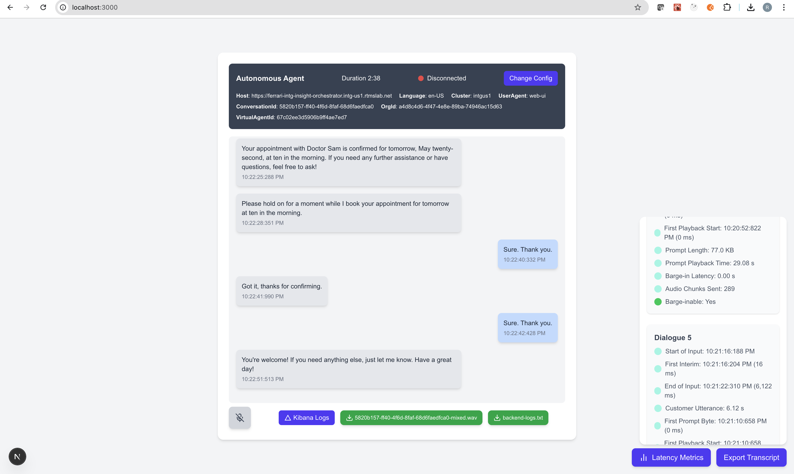
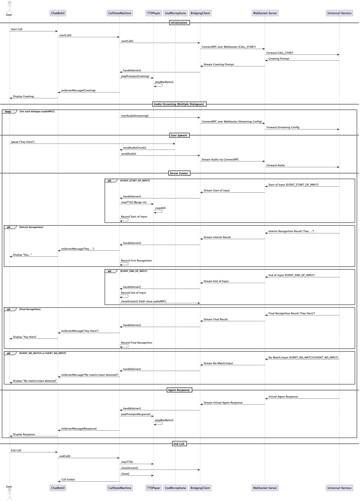

# 🧠 Autonomous Agent Web UI

A **Next.js + React** front-end with a **Node.js WebSocket bridge**, designed to test, debug, and interact with **real-time voice-based autonomous agents**. This tool allows users to stream audio, receive AI responses, visualize latency, and debug entire conversations with rich insight and control.


## 📌 Objective

The tool is designed to:

* 🐞 **Debug speech recognition**, virtual agent responses, and audio playback in real time.
* 🗣️ **Test barge-in support**, where users interrupt agent speech.
* 📊 **Analyze latency metrics**, such as silence gaps, utterance lengths, and playback delays.
* 🔁 **Stream real-time interactions** with full support for STT → LLM → TTS loop.
* ⚠️ **Handle errors robustly**, making it ideal for QA, demos, and debugging.

---

## 🖥️ Tool Snapshot

Here's how the live UI looks in the browser:



---

## 🧭 Architecture Overview

This diagram illustrates the client-browser components, Node.js WebSocket bridge, and how they interact with the gRPC-based `Universal Harness` backend:


---

## 🔄 Call Flow (Sequence Diagram)

The flow below captures the full lifecycle of a conversation, from initialization to final response and termination:



---

## 🔧 Prerequisites

* **Node.js** v16+ with **npm**, **Yarn**, or **PNPM**
* Optional: **Docker** (for containerized deployment)

---

## 🚀 Quick Start (Local)

### 1. Install Dependencies

```bash
npm install
# or
yarn
# or
pnpm install
```

### 2. Start WebSocket Bridge (Port 3001)

```bash
npx ts-node -r tsconfig-paths/register src/server/wsServer.ts > server.log
```

> Logs are stored in `server.log`.

### 3. Start Frontend (Port 3000)

```bash
npm run dev
```

Access the app at [http://localhost:3000](http://localhost:3000)

---

## 🐳 Running with Docker

### 1. Build Image

```bash
docker build -t media-ui .
```

### 2. Run Container

```bash
docker run -d \
  -p 3000:3000 \
  -p 3001:3001 \
  --name media-ui \
  media-ui
```

* **Frontend** → [http://localhost:3000](http://localhost:3000)
* **WebSocket Bridge** → `ws://localhost:3001/ws`

---

## 📜 Common Scripts

| Command         | Description                     |
| --------------- | ------------------------------- |
| `npm run dev`   | Start dev server (hot reload)   |
| `npm run build` | Build production-ready frontend |
| `npm start`     | Serve built frontend            |

---

## ⚙️ Configuration

Open [http://localhost:3000](http://localhost:3000), then enter:

* Orchestrator Host
* Bearer Token
* Org ID, Conversation ID
* Language, Virtual Agent ID, and other settings

> These settings are stored in `localStorage` for persistence across sessions.

---

## 🧩 Key Functionalities

### 🎤 Real-Time Audio Streaming

* Capture user speech using **WebRTC**
* Stream via **ConnectRPC** over WebSocket
* Supports µ-law and WAV formats

### 🧠 Speech Recognition

* Real-time STT with **interim** and **final** results
* Supports barge-in: interrupt the agent mid-response

### 🔊 Text-to-Speech Playback

* Play virtual agent responses using Web Audio API
* Interruptible playback with barge-in

### 💬 Chat UI + Transcript

* Clean chat-like display of the full conversation
* Timestamped messages
* Option to export as HTML

### 📈 Latency Metrics

* View detailed latency per turn
* Metrics include audio chunk count, silence duration, and more

### 🛠️ Error Handling

* All major actions are logged
* Backend logs downloadable for analysis
* Clear UI messages for common failures

### 📤 Downloads

* Recording (WAV) after session ends
* Transcript + backend logs available for export

---

## 🔁 High-Level Interaction Flow

1. User starts a call via the UI.
2. `CallStateMachine` initializes the session.
3. `BridgingClient` connects to the backend using WebSocket.
4. `Universal Harness` sends initial prompt → plays via `TTSPlayer`.
5. User speaks → `UseMicrophone` streams audio.
6. Backend sends STT results (interim/final) → displayed in UI.
7. Agent response is received and played.
8. Session ends with all logs, recordings, and transcript export available.

